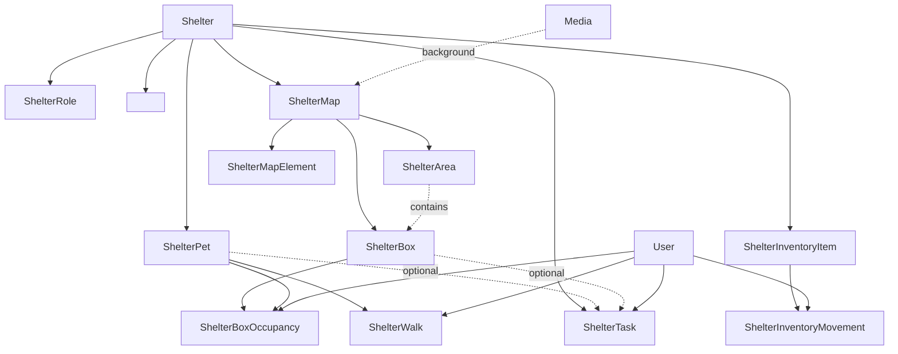

# Shelter Management — Specifica tecnica

Questo documento raccoglie **tutte le modifiche da apportare** al backend `graph-a-pet-backend` (e le corrispondenti operazioni GraphQL da consumare lato `graph-a-pet-app`) per introdurre due nuove aree funzionali collegate al modulo **Shelters**:

1. **Gestione operativa del canile** — pulizie, passeggiate dei cani del rifugio, rifornimenti/inventario.
2. **Mappatura grafica 2D del canile** — editor visuale di aree, box (con dimensioni), occupazione dei box da parte dei cani.

Entrambe le aree si innestano sulle entità già presenti: `Shelter`, `ShelterRole`, `ShelterPet` (vedi [backend.md §5](backend.md)) e seguono il pattern architetturale a tre layer già in uso (`api/` → `domain/` → `repository/`).

---

## Indice

- [0. Convenzioni](#0-convenzioni)
- [1. Gestione operativa](#1-gestione-operativa)
    - [1.1 ShelterTask](#11-sheltertask)
    - [1.2 ShelterWalk](#12-shelterwalk)
    - [1.3 ShelterInventoryItem + ShelterInventoryMovement](#13-shelterinventoryitem--shelterinventorymovement)
- [2. Mappatura grafica 2D](#2-mappatura-grafica-2d)
    - [2.1 ShelterMap](#21-sheltermap)
    - [2.2 ShelterArea](#22-shelterarea)
    - [2.3 ShelterBox](#23-shelterbox)
    - [2.4 ShelterBoxOccupancy](#24-shelterboxoccupancy)
    - [2.5 ShelterMapElement (opzionale)](#25-sheltermapelement-opzionale)
- [3. Diagramma relazioni](#3-diagramma-relazioni)
- [4. Modifiche per layer](#4-modifiche-per-layer)
- [5. Migrazioni Alembic](#5-migrazioni-alembic)
- [6. Autorizzazione](#6-autorizzazione)
- [7. Integrazione frontend](#7-integrazione-frontend)
- [8. Roadmap di implementazione](#8-roadmap-di-implementazione)

---

## 0. Convenzioni

- **Naming SQL**: snake_case, tabelle al plurale (`shelter_tasks`, `shelter_boxes`, `shelter_box_occupancies`, ecc.).
- **Naming GraphQL**: PascalCase per tipi, camelCase per campi/mutation, `*Result` per i payload di mutation con `{ success, error, <entity>? }`, `Paginated*` per le liste (coerente con lo schema esistente).
- **Timestamps**: ogni tabella ha `id: UUID`, `created_at: timestamptz` (già pattern in `repository/models.py`).
- **Coordinate mappa**: `Float` con `unit` per riga `ShelterMap` (`METERS` o `PIXELS`). Il front-end sceglie lo zoom.
- **Autorizzazione**: tutte le mutation di scrittura richiedono `ShelterRole` >= `STAFF` sullo `shelter_id` corrispondente. Le mutation di layout (`ShelterMap`, `ShelterArea`, `ShelterBox`, `ShelterMapElement`) richiedono `MANAGER` o `OWNER`.
- **Non modificare** le entità esistenti (`Shelter`, `ShelterRole`, `ShelterPet`) se non per aggiungere relazioni inverse nei resolver GraphQL.

---

## 1. Gestione operativa

### 1.1 ShelterTask

Attività ricorrenti o una-tantum svolte nel canile: pulizie, disinfezioni, distribuzione pasti, medicazioni.

**Colonne DB** (`repository/shelter_tasks/models.py`):

| Campo | Tipo | Note |
|---|---|---|
| `id` | UUID PK | |
| `created_at` | timestamptz | default now |
| `shelter_id` | UUID FK → `shelters.id` | not null, index |
| `shelter_pet_id` | UUID FK → `shelter_pets.id` | nullable — task legata a un cane specifico |
| `shelter_box_id` | UUID FK → `shelter_boxes.id` | nullable — task legata a un box |
| `task_type` | enum `shelter_task_type` | vedi sotto |
| `area` | varchar(120) | descrizione libera ("Box 12", "Reparto cuccioli") |
| `status` | enum `shelter_task_status` | default `PENDING` |
| `assigned_to_id` | UUID FK → `users.id` | nullable |
| `scheduled_at` | timestamptz | nullable |
| `completed_at` | timestamptz | nullable |
| `completed_by_id` | UUID FK → `users.id` | nullable |
| `is_recurring` | boolean | default false |
| `recurrence_rule` | varchar(120) | es. `DAILY`, `WEEKLY:MON,WED,FRI`, o cron |
| `notes` | text | nullable |

**Enum**:

```python
class ShelterTaskType(str, Enum):
    CLEANING = "CLEANING"
    DEEP_CLEANING = "DEEP_CLEANING"
    FEEDING = "FEEDING"
    MEDICATION = "MEDICATION"
    GROOMING = "GROOMING"
    OTHER = "OTHER"

class TaskStatus(str, Enum):
    PENDING = "PENDING"
    IN_PROGRESS = "IN_PROGRESS"
    COMPLETED = "COMPLETED"
    SKIPPED = "SKIPPED"
```

Aggiungere un `CHECK constraint` su entrambe le enum in stile [alembic/versions/a1b2c3d4e5f6_add_check_treatmenttype.py](alembic/versions/a1b2c3d4e5f6_add_check_treatmenttype.py).

**GraphQL** (schema.graphql):

```graphql
enum ShelterTaskType { CLEANING DEEP_CLEANING FEEDING MEDICATION GROOMING OTHER }
enum TaskStatus { PENDING IN_PROGRESS COMPLETED SKIPPED }

type ShelterTask {
    id: ID!
    created_at: String!
    shelter: Shelter!
    shelter_pet: ShelterPet
    shelter_box: ShelterBox
    task_type: ShelterTaskType!
    area: String
    status: TaskStatus!
    assigned_to: User
    scheduled_at: String
    completed_at: String
    completed_by: User
    is_recurring: Boolean!
    recurrence_rule: String
    notes: String
}

type ShelterTaskResult { success: Boolean! error: Error shelter_task: ShelterTask }
type PaginatedShelterTasks { success: Boolean error: Error items: [ShelterTask]! pagination: Pagination! }

input ShelterTaskCreate {
    shelter_id: ID!
    shelter_pet_id: ID
    shelter_box_id: ID
    task_type: ShelterTaskType!
    area: String
    assigned_to_id: ID
    scheduled_at: String
    is_recurring: Boolean = false
    recurrence_rule: String
    notes: String
}

input ShelterTaskUpdate {
    task_type: ShelterTaskType
    area: String
    assigned_to_id: ID
    scheduled_at: String
    is_recurring: Boolean
    recurrence_rule: String
    notes: String
}
```

**Query**:

- `listShelterTasks(commonSearch: CommonSearch = {}): PaginatedShelterTasks!`
- `getShelterTask(id: ID!): ShelterTaskResult!`

**Mutation**:

- `createShelterTask(data: ShelterTaskCreate!): ShelterTaskResult!`
- `updateShelterTask(id: ID!, data: ShelterTaskUpdate!): ShelterTaskResult!`
- `completeShelterTask(id: ID!, notes: String): ShelterTaskResult!` — imposta `status=COMPLETED`, `completed_at=now`, `completed_by_id=me.id`.
- `skipShelterTask(id: ID!, reason: String): ShelterTaskResult!`
- `deleteShelterTask(id: ID!): DeleteResult!`

**Job schedulato** (`schedules/shelter_tasks.py`): ogni notte materializza le occorrenze delle task ricorrenti per il giorno successivo (crea record `PENDING` a partire dai template `is_recurring=true`).

---

### 1.2 ShelterWalk

Passeggiate dei cani del rifugio. **Distinta** dall'entità `Walk` esistente (che è legata a `Ownership` per pet privati).

**Colonne DB** (`repository/shelter_walks/models.py`):

| Campo | Tipo | Note |
|---|---|---|
| `id` | UUID PK | |
| `created_at` | timestamptz | |
| `shelter_pet_id` | UUID FK → `shelter_pets.id` | not null, index |
| `walker_id` | UUID FK → `users.id` | not null — volontario/staff |
| `status` | enum `shelter_walk_status` | default `PLANNED` |
| `scheduled_at` | timestamptz | nullable |
| `started_at` | timestamptz | nullable |
| `ended_at` | timestamptz | nullable |
| `duration_minutes` | int | derivato (opzionale in DB, computato dal resolver) |
| `notes` | text | nullable |

**Enum**:

```python
class ShelterWalkStatus(str, Enum):
    PLANNED = "PLANNED"
    IN_PROGRESS = "IN_PROGRESS"
    COMPLETED = "COMPLETED"
    CANCELLED = "CANCELLED"
```

**GraphQL**:

```graphql
enum ShelterWalkStatus { PLANNED IN_PROGRESS COMPLETED CANCELLED }

type ShelterWalk {
    id: ID!
    created_at: String!
    shelter_pet: ShelterPet!
    walker: User!
    status: ShelterWalkStatus!
    scheduled_at: String
    started_at: String
    ended_at: String
    duration_minutes: Int
    notes: String
}

type ShelterWalkResult { success: Boolean! error: Error shelter_walk: ShelterWalk }
type PaginatedShelterWalks { success: Boolean error: Error items: [ShelterWalk]! pagination: Pagination! }

input ShelterWalkCreate {
    shelter_pet_id: ID!
    walker_id: ID              # se omesso: current user
    scheduled_at: String
    notes: String
}

input ShelterWalkUpdate {
    scheduled_at: String
    notes: String
}
```

**Query**:

- `listShelterWalks(commonSearch: CommonSearch = {}): PaginatedShelterWalks!`
- `getShelterWalk(id: ID!): ShelterWalkResult!`
- `listPetsNeedingWalk(shelter_id: ID!, hours: Int = 24): PaginatedShelterPets!` — filtra i cani del rifugio senza `ShelterWalk COMPLETED` nelle ultime N ore. Utile per il pannello volontari.

**Mutation**:

- `createShelterWalk(data: ShelterWalkCreate!): ShelterWalkResult!`
- `updateShelterWalk(id: ID!, data: ShelterWalkUpdate!): ShelterWalkResult!`
- `startShelterWalk(id: ID!): ShelterWalkResult!` — `status=IN_PROGRESS`, `started_at=now`.
- `completeShelterWalk(id: ID!, notes: String): ShelterWalkResult!` — `status=COMPLETED`, `ended_at=now`, calcola `duration_minutes`.
- `cancelShelterWalk(id: ID!, reason: String): ShelterWalkResult!`
- `deleteShelterWalk(id: ID!): DeleteResult!`

---

### 1.3 ShelterInventoryItem + ShelterInventoryMovement

Catalogo articoli (cibo, farmaci, materiali) + movimenti a saldo. La quantità corrente è **derivata dai movimenti**, non duplicata.

#### `shelter_inventory_items`

| Campo | Tipo | Note |
|---|---|---|
| `id` | UUID PK | |
| `created_at` | timestamptz | |
| `shelter_id` | UUID FK → `shelters.id` | not null, index |
| `name` | varchar(160) | not null |
| `category` | enum `inventory_category` | |
| `unit` | varchar(20) | "kg", "l", "pz" |
| `minimum_threshold` | numeric(10,3) | nullable — soglia alert |
| `notes` | text | nullable |

#### `shelter_inventory_movements`

| Campo | Tipo | Note |
|---|---|---|
| `id` | UUID PK | |
| `created_at` | timestamptz | |
| `item_id` | UUID FK → `shelter_inventory_items.id` | not null, index |
| `movement_type` | enum `movement_type` | |
| `quantity` | numeric(10,3) | segno secondo `movement_type` |
| `registered_by_id` | UUID FK → `users.id` | not null |
| `notes` | text | nullable |

**Enum**:

```python
class InventoryCategory(str, Enum):
    FOOD_DRY = "FOOD_DRY"
    FOOD_WET = "FOOD_WET"
    MEDICINE = "MEDICINE"
    HYGIENE = "HYGIENE"
    EQUIPMENT = "EQUIPMENT"
    OTHER = "OTHER"

class MovementType(str, Enum):
    RESTOCK = "RESTOCK"          # + quantity
    CONSUMPTION = "CONSUMPTION"  # - quantity
    DONATION = "DONATION"        # + quantity
    WASTE = "WASTE"              # - quantity
    ADJUSTMENT = "ADJUSTMENT"    # +/- correzione manuale
```

**GraphQL**:

```graphql
enum InventoryCategory { FOOD_DRY FOOD_WET MEDICINE HYGIENE EQUIPMENT OTHER }
enum MovementType { RESTOCK CONSUMPTION DONATION WASTE ADJUSTMENT }

type ShelterInventoryItem {
    id: ID!
    created_at: String!
    shelter: Shelter!
    name: String!
    category: InventoryCategory!
    unit: String!
    minimum_threshold: Float
    current_quantity: Float!          # derivato: SUM(movements.quantity)
    is_below_threshold: Boolean!      # derivato
    notes: String
    movements(commonSearch: CommonSearch = {}): PaginatedInventoryMovements
}

type ShelterInventoryMovement {
    id: ID!
    created_at: String!
    item: ShelterInventoryItem!
    movement_type: MovementType!
    quantity: Float!
    registered_by: User!
    notes: String
}

type ShelterInventoryItemResult { success: Boolean! error: Error item: ShelterInventoryItem }
type ShelterInventoryMovementResult { success: Boolean! error: Error movement: ShelterInventoryMovement }
type PaginatedInventoryItems { success: Boolean error: Error items: [ShelterInventoryItem]! pagination: Pagination! }
type PaginatedInventoryMovements { success: Boolean error: Error items: [ShelterInventoryMovement]! pagination: Pagination! }

input ShelterInventoryItemCreate {
    shelter_id: ID!
    name: String!
    category: InventoryCategory!
    unit: String!
    minimum_threshold: Float
    notes: String
    initial_quantity: Float           # se >0 crea automaticamente un movimento RESTOCK
}

input ShelterInventoryItemUpdate {
    name: String
    category: InventoryCategory
    unit: String
    minimum_threshold: Float
    notes: String
}

input ShelterInventoryMovementCreate {
    item_id: ID!
    movement_type: MovementType!
    quantity: Float!                  # sempre positivo, il segno è imposto dal type
    notes: String
}
```

**Query**:

- `listShelterInventoryItems(commonSearch: CommonSearch = {}): PaginatedInventoryItems!`
- `getShelterInventoryItem(id: ID!): ShelterInventoryItemResult!`
- `listShelterInventoryMovements(commonSearch: CommonSearch = {}): PaginatedInventoryMovements!`
- `listLowStockItems(shelter_id: ID!): PaginatedInventoryItems!` — solo item sotto soglia.

**Mutation**:

- `createShelterInventoryItem(data: ShelterInventoryItemCreate!): ShelterInventoryItemResult!`
- `updateShelterInventoryItem(id: ID!, data: ShelterInventoryItemUpdate!): ShelterInventoryItemResult!`
- `deleteShelterInventoryItem(id: ID!): DeleteResult!`
- `createShelterInventoryMovement(data: ShelterInventoryMovementCreate!): ShelterInventoryMovementResult!`

**Regola di business** (`domain/shelter_inventory/services.py`): il domain applica il segno alla quantità del movimento in base al `movement_type` prima di salvarla (`CONSUMPTION`, `WASTE` → segno negativo; `RESTOCK`, `DONATION` → positivo; `ADJUSTMENT` → mantiene il segno dell'input).

---

## 2. Mappatura grafica 2D

### 2.1 ShelterMap

Un canvas del rifugio. Un rifugio può avere più mappe (piano terra, piano 1, giardino esterno).

**Colonne DB** (`repository/shelter_maps/models.py`):

| Campo | Tipo | Note |
|---|---|---|
| `id` | UUID PK | |
| `created_at` | timestamptz | |
| `shelter_id` | UUID FK → `shelters.id` | not null, index |
| `name` | varchar(120) | |
| `width` | numeric(10,2) | dimensione canvas |
| `height` | numeric(10,2) | |
| `unit` | enum `map_unit` | `METERS` \| `PIXELS` |
| `background_media_id` | UUID FK → `medias.id` | nullable — planimetria di riferimento |

**GraphQL**:

```graphql
enum MapUnit { METERS PIXELS }

type ShelterMap {
    id: ID!
    created_at: String!
    shelter: Shelter!
    name: String!
    width: Float!
    height: Float!
    unit: MapUnit!
    background_media: Media
    areas: [ShelterArea!]!
    boxes: [ShelterBox!]!
    elements: [ShelterMapElement!]!
}

type ShelterMapResult { success: Boolean! error: Error map: ShelterMap }
type PaginatedShelterMaps { success: Boolean error: Error items: [ShelterMap]! pagination: Pagination! }

input ShelterMapCreate {
    shelter_id: ID!
    name: String!
    width: Float!
    height: Float!
    unit: MapUnit = METERS
    background_media_id: ID
}

input ShelterMapUpdate {
    name: String
    width: Float
    height: Float
    unit: MapUnit
    background_media_id: ID
}
```

### 2.2 ShelterArea

Zona logica (rettangolo colorato) che raggruppa più box.

**Colonne**:

| Campo | Tipo | Note |
|---|---|---|
| `id` | UUID PK | |
| `created_at` | timestamptz | |
| `map_id` | UUID FK → `shelter_maps.id` | not null, index, `ON DELETE CASCADE` |
| `name` | varchar(120) | |
| `area_type` | enum `area_type` | |
| `x`, `y`, `width`, `height` | numeric(10,2) | |
| `color` | varchar(20) | esadecimale + alfa, es. `#4CAF5033` |

**Enum**:

```python
class AreaType(str, Enum):
    KENNEL = "KENNEL"
    QUARANTINE = "QUARANTINE"
    PLAYGROUND = "PLAYGROUND"
    MEDICAL = "MEDICAL"
    STORAGE = "STORAGE"
    OFFICE = "OFFICE"
    COMMON = "COMMON"
    OUTDOOR = "OUTDOOR"
    OTHER = "OTHER"
```

**GraphQL**:

```graphql
enum AreaType { KENNEL QUARANTINE PLAYGROUND MEDICAL STORAGE OFFICE COMMON OUTDOOR OTHER }

type ShelterArea {
    id: ID!
    created_at: String!
    map_id: ID!
    name: String!
    area_type: AreaType!
    x: Float!
    y: Float!
    width: Float!
    height: Float!
    color: String
    boxes: [ShelterBox!]!
}

input ShelterAreaCreate {
    map_id: ID!
    name: String!
    area_type: AreaType!
    x: Float!
    y: Float!
    width: Float!
    height: Float!
    color: String
}

input ShelterAreaUpdate {
    name: String
    area_type: AreaType
    x: Float
    y: Float
    width: Float
    height: Float
    color: String
}
```

### 2.3 ShelterBox

Il box fisico. Ha posizione, dimensione, capienza e uno **stato derivato** dagli occupanti attivi.

**Colonne**:

| Campo | Tipo | Note |
|---|---|---|
| `id` | UUID PK | |
| `created_at` | timestamptz | |
| `map_id` | UUID FK → `shelter_maps.id` | not null, index, `ON DELETE CASCADE` |
| `area_id` | UUID FK → `shelter_areas.id` | nullable |
| `label` | varchar(60) | not null; unique per `map_id` |
| `x`, `y`, `width`, `height` | numeric(10,2) | |
| `rotation` | numeric(6,2) | default 0 (gradi) |
| `capacity` | int | default 1, > 0 (CHECK) |
| `is_out_of_service` | boolean | default false |
| `last_cleaned_at` | timestamptz | nullable |
| `notes` | text | nullable |

**Enum** (solo GraphQL, non persistito):

```python
class BoxStatus(str, Enum):
    FREE = "FREE"
    OCCUPIED = "OCCUPIED"
    FULL = "FULL"
    OUT_OF_SERVICE = "OUT_OF_SERVICE"
```

Il valore è calcolato dal resolver in base a `current_occupants` e `is_out_of_service`.

**GraphQL**:

```graphql
enum BoxStatus { FREE OCCUPIED FULL OUT_OF_SERVICE }

type ShelterBox {
    id: ID!
    created_at: String!
    map_id: ID!
    area: ShelterArea
    label: String!
    x: Float!
    y: Float!
    width: Float!
    height: Float!
    rotation: Float!
    capacity: Int!
    status: BoxStatus!                       # derivato
    is_out_of_service: Boolean!
    current_occupants: [ShelterPet!]!        # derivato (join su occupancies attive)
    occupancy_history(commonSearch: CommonSearch = {}): PaginatedBoxOccupancies
    last_cleaned_at: String
    notes: String
}

input ShelterBoxCreate {
    map_id: ID!
    area_id: ID
    label: String!
    x: Float!
    y: Float!
    width: Float!
    height: Float!
    rotation: Float = 0
    capacity: Int = 1
    notes: String
}

input ShelterBoxUpdate {
    area_id: ID
    label: String
    x: Float
    y: Float
    width: Float
    height: Float
    rotation: Float
    capacity: Int
    is_out_of_service: Boolean
    notes: String
}
```

### 2.4 ShelterBoxOccupancy

Tabella "ponte" con validità temporale tra `ShelterBox` e `ShelterPet`. Verità unica sullo stato dei box.

**Colonne**:

| Campo | Tipo | Note |
|---|---|---|
| `id` | UUID PK | |
| `created_at` | timestamptz | |
| `box_id` | UUID FK → `shelter_boxes.id` | not null, index |
| `shelter_pet_id` | UUID FK → `shelter_pets.id` | not null, index |
| `entered_at` | timestamptz | default now |
| `exited_at` | timestamptz | nullable; NULL = attiva |
| `moved_by_id` | UUID FK → `users.id` | nullable |
| `reason` | varchar(200) | nullable |

**Vincoli DB critici**:

- **Unique parziale**: al massimo una occupancy attiva per pet:
    ```sql
    CREATE UNIQUE INDEX ux_shelter_pet_active_occupancy
        ON shelter_box_occupancies (shelter_pet_id)
        WHERE exited_at IS NULL;
    ```
- CHECK: `exited_at IS NULL OR exited_at >= entered_at`.

**GraphQL**:

```graphql
type ShelterBoxOccupancy {
    id: ID!
    created_at: String!
    box: ShelterBox!
    shelter_pet: ShelterPet!
    entered_at: String!
    exited_at: String
    moved_by: User
    reason: String
}

type ShelterBoxOccupancyResult { success: Boolean! error: Error occupancy: ShelterBoxOccupancy }
type PaginatedBoxOccupancies { success: Boolean error: Error items: [ShelterBoxOccupancy]! pagination: Pagination! }
```

### 2.5 ShelterMapElement (opzionale)

Elementi decorativi non interattivi per una planimetria "vera": muri, porte, arredi. Da introdurre in una fase successiva.

**Colonne**:

| Campo | Tipo | Note |
|---|---|---|
| `id` | UUID PK | |
| `map_id` | UUID FK → `shelter_maps.id` | ON DELETE CASCADE |
| `element_type` | enum | `WALL` \| `DOOR` \| `GATE` \| `WATER_POINT` \| `FEEDING_POINT` \| `BENCH` \| `TREE` \| `OTHER` |
| `x`, `y`, `width`, `height`, `rotation` | numeric | |
| `color` | varchar(20) | |
| `label` | varchar(120) | nullable |

---

### 2.6 Mutation della mappa

**Layout editor** (drag & drop → un'unica call atomica):

```graphql
extend type Mutation {
    # Map CRUD
    createShelterMap(data: ShelterMapCreate!): ShelterMapResult!
    updateShelterMap(id: ID!, data: ShelterMapUpdate!): ShelterMapResult!
    deleteShelterMap(id: ID!): DeleteResult!

    # Area CRUD
    createShelterArea(data: ShelterAreaCreate!): ShelterAreaResult!
    updateShelterArea(id: ID!, data: ShelterAreaUpdate!): ShelterAreaResult!
    deleteShelterArea(id: ID!): DeleteResult!

    # Box CRUD
    createShelterBox(data: ShelterBoxCreate!): ShelterBoxResult!
    updateShelterBox(id: ID!, data: ShelterBoxUpdate!): ShelterBoxResult!
    deleteShelterBox(id: ID!): DeleteResult!

    # Batch atomico — usato dall'editor visuale
    saveShelterMapLayout(map_id: ID!, data: ShelterMapLayoutInput!): ShelterMapResult!

    # Occupancy (uso operativo)
    assignPetToBox(box_id: ID!, shelter_pet_id: ID!, reason: String): ShelterBoxOccupancyResult!
    releasePetFromBox(occupancy_id: ID!, reason: String): ShelterBoxOccupancyResult!
    movePetBetweenBoxes(shelter_pet_id: ID!, to_box_id: ID!, reason: String): ShelterBoxOccupancyResult!

    # Manutenzione
    markBoxCleaned(box_id: ID!): ShelterBoxResult!
    setBoxOutOfService(box_id: ID!, out_of_service: Boolean!): ShelterBoxResult!
}

input ShelterMapLayoutInput {
    areas: [ShelterAreaUpsert!]!
    boxes: [ShelterBoxUpsert!]!
    elements: [ShelterMapElementUpsert!]
    deleted_area_ids: [ID!]
    deleted_box_ids: [ID!]
    deleted_element_ids: [ID!]
}

input ShelterAreaUpsert {
    id: ID                # null = create
    name: String!
    area_type: AreaType!
    x: Float! y: Float! width: Float! height: Float!
    color: String
}

input ShelterBoxUpsert {
    id: ID
    area_id: ID
    label: String!
    x: Float! y: Float! width: Float! height: Float!
    rotation: Float = 0
    capacity: Int = 1
}

input ShelterMapElementUpsert {
    id: ID
    element_type: MapElementType!
    x: Float! y: Float! width: Float! height: Float!
    rotation: Float = 0
    color: String
    label: String
}
```

**Regole di business** (`domain/shelter_boxes/services.py`, `domain/shelter_occupancies/services.py`):

- `assignPetToBox` fallisce se il pet ha già un'occupancy attiva (l'utente deve prima chiamare `releasePetFromBox` o usare `movePetBetweenBoxes`).
- `assignPetToBox` fallisce se `box.is_out_of_service` o se `current_occupants.length >= box.capacity`.
- `movePetBetweenBoxes` è atomico: chiude l'occupancy corrente (`exited_at=now`) e ne apre una nuova sul box destinazione.
- `saveShelterMapLayout` esegue tutto in una transazione: qualsiasi violazione rollback totale.

**Query aggiuntive**:

```graphql
extend type Query {
    listShelterMaps(commonSearch: CommonSearch = {}): PaginatedShelterMaps!
    getShelterMap(id: ID!): ShelterMapResult!
    listShelterBoxes(commonSearch: CommonSearch = {}): PaginatedShelterBoxes!
    getShelterBox(id: ID!): ShelterBoxResult!
    listShelterBoxOccupancies(commonSearch: CommonSearch = {}): PaginatedBoxOccupancies!
    getCurrentBoxForPet(shelter_pet_id: ID!): ShelterBoxResult!
}
```

---

## 3. Diagramma relazioni



---

## 4. Modifiche per layer

Seguendo il pattern documentato in [backend.md §4](backend.md):

### 4.1 Repository (`repository/`)

Nuove cartelle (una per entità), ognuna con `models.py` + `views.py`:

- `repository/shelter_tasks/`
- `repository/shelter_walks/`
- `repository/shelter_inventory_items/`
- `repository/shelter_inventory_movements/`
- `repository/shelter_maps/`
- `repository/shelter_areas/`
- `repository/shelter_boxes/`
- `repository/shelter_box_occupancies/`
- `repository/shelter_map_elements/` (fase 4)

Aggiornare l'aggregatore [repository/models.py](repository/models.py) con:

```python
from .shelter_tasks.models import *
from .shelter_walks.models import *
from .shelter_inventory_items.models import *
from .shelter_inventory_movements.models import *
from .shelter_maps.models import *
from .shelter_areas.models import *
from .shelter_boxes.models import *
from .shelter_box_occupancies.models import *
```

Aggiornare [db_scheme.json](db_scheme.json) con le nuove tabelle (usato dalla query builder generica).

### 4.2 Domain (`domain/`)

Nuove cartelle sorella con i servizi di business:

- `domain/shelter_tasks/`
- `domain/shelter_walks/`
- `domain/shelter_inventory/`
- `domain/shelter_maps/`
- `domain/shelter_boxes/`
- `domain/shelter_occupancies/`

Logica chiave da mettere qui:

- Materializzazione ricorrenze `ShelterTask` (chiamata dal cron in `schedules/shelter_tasks.py`).
- Calcolo `current_quantity` inventario (SUM su movimenti).
- Applicazione segno a `MovementType`.
- Validazioni `assignPetToBox` (capacity, out_of_service, occupancy unica).
- Transazione atomica `saveShelterMapLayout` e `movePetBetweenBoxes`.
- Alert Telegram (`utils/telegram/`) opzionale per: task saltate, item sotto soglia, box "occupato oltre X giorni senza pulizia".

### 4.3 API (`api/`)

Nuove cartelle con `queries.py`, `mutations.py`, `resolvers.py`:

- `api/shelter_tasks/`
- `api/shelter_walks/`
- `api/shelter_inventory/`
- `api/shelter_maps/`
- `api/shelter_boxes/`
- `api/shelter_occupancies/`

**Registrare tutti i resolver** in [api/operations.py](api/operations.py) (Ariadne richiede un unico punto di registrazione — vedi [backend.md §4.1](backend.md)):

```python
# Queries
query.set_field("listShelterTasks", list_shelter_tasks_resolver)
query.set_field("getShelterTask", get_shelter_task_resolver)
# ... tutti i restanti

# Mutations
mutation.set_field("createShelterTask", create_shelter_task_resolver)
mutation.set_field("completeShelterTask", complete_shelter_task_resolver)
mutation.set_field("saveShelterMapLayout", save_shelter_map_layout_resolver)
# ... tutti i restanti
```

Aggiungere `ObjectType` per resolver field-level:

- `ShelterBoxType.set_field("status", resolve_box_status)`
- `ShelterBoxType.set_field("current_occupants", resolve_current_occupants)`
- `ShelterInventoryItemType.set_field("current_quantity", resolve_current_quantity)`
- `ShelterInventoryItemType.set_field("is_below_threshold", resolve_is_below_threshold)`

### 4.4 Schema GraphQL (`schema.graphql`)

Aggiungere in ordine (fine file, prima delle dichiarazioni `input` condivise):

1. Sezione `# ShelterTask` con enum, type, input, result, paginated.
2. Sezione `# ShelterWalk` idem.
3. Sezione `# ShelterInventory` (item + movement).
4. Sezione `# ShelterMap` con `MapUnit`.
5. Sezione `# ShelterArea` con `AreaType`.
6. Sezione `# ShelterBox` con `BoxStatus`.
7. Sezione `# ShelterBoxOccupancy`.
8. (Fase 4) Sezione `# ShelterMapElement`.

Estendere i blocchi `type Query` e `type Mutation` esistenti con i nuovi field (vedi §1 e §2).

---

## 5. Migrazioni Alembic

Creare una migration per fase (workflow documentato in [backend.md §9](backend.md)):

| Ordine | Migration | Contenuto |
|---|---|---|
| 1 | `xxxx_shelter_tasks.py` | Tabella `shelter_tasks` + enum + CHECK constraints |
| 2 | `xxxx_shelter_walks.py` | Tabella `shelter_walks` + enum |
| 3 | `xxxx_shelter_inventory.py` | `shelter_inventory_items` + `shelter_inventory_movements` + enum |
| 4 | `xxxx_shelter_maps_boxes.py` | `shelter_maps` + `shelter_areas` + `shelter_boxes` + FK con `ON DELETE CASCADE` |
| 5 | `xxxx_shelter_box_occupancies.py` | `shelter_box_occupancies` + unique parziale + CHECK |
| 6 | `xxxx_shelter_map_elements.py` (opz.) | `shelter_map_elements` |

Comando (dal readme):

```bash
alembic revision --autogenerate -m "shelter_tasks"
alembic upgrade head
```

Ricordarsi di ispezionare l'autogenerazione: le enum e i CHECK constraint spesso vanno scritti a mano (vedi [alembic/versions/a1b2c3d4e5f6_add_check_treatmenttype.py](alembic/versions/a1b2c3d4e5f6_add_check_treatmenttype.py) come reference).

---

## 6. Autorizzazione

Applicare i decoratori esistenti (`@auth_middleware`, `@min_role`) definiti in [api/middlewares.py](api/middlewares.py):

| Operazione | Ruolo minimo |
|---|---|
| Query di lettura (`list*`, `get*`) | Membro dello shelter (`STAFF` o superiore) |
| Task/Walk CRUD, completamento task/walk | `STAFF` |
| Assegnazione occupancy, spostamento pet | `STAFF` |
| Movimenti inventario | `STAFF` |
| Creazione/modifica item inventario | `MANAGER` |
| Editor mappa (`saveShelterMapLayout`, CRUD `Map`/`Area`/`Box`/`Element`) | `MANAGER` |
| Delete di `Shelter*` | `OWNER` |

Poiché `@min_role` attuale valuta solo il `UserRole` globale (`ADMIN`/`USER`), va aggiunto un decoratore specifico:

```python
def min_shelter_role(role: RoleLevel):
    """Verifica che l'utente abbia almeno <role> sullo shelter_id passato come argomento o derivato dall'entità."""
    ...
```

Da implementare in `api/middlewares.py` e applicare a tutti i resolver che operano su un singolo rifugio.

---

## 7. Integrazione frontend

Nel modulo esistente [graph-a-pet-app/src/modules/shelters/](../graph-a-pet-app/src/modules/shelters/):

### 7.1 Nuove pagine

```
src/modules/shelters/pages/
├── ShelterDetail.tsx              # (già esistente) → aggiungere tab Tasks, Walks, Inventory, Map
├── ShelterTasksList.tsx           # nuovo
├── ShelterWalksList.tsx           # nuovo
├── ShelterInventory.tsx           # nuovo
└── ShelterMapEditor.tsx           # nuovo — editor 2D
```

### 7.2 Nuovi componenti

```
src/modules/shelters/components/
├── ShelterCard.tsx                # (già esistente)
├── TaskCard.tsx
├── WalkCard.tsx
├── InventoryItemRow.tsx
├── LowStockAlert.tsx
├── MapCanvas.tsx                  # rendering SVG + drag&drop
├── MapCanvasBox.tsx               # componente box (colore per status)
├── MapCanvasArea.tsx
├── BoxAssignmentModal.tsx         # scegli quale cane assegnare
└── OccupancyHistoryList.tsx
```

### 7.3 Nuove operazioni GraphQL

Aggiungere in [src/modules/shelters/operations/](../graph-a-pet-app/src/modules/shelters/operations/):

**Fragments**:
- `MinShelterTask.graphql`, `MinShelterWalk.graphql`, `MinInventoryItem.graphql`
- `FullShelterMap.graphql`, `MinShelterBox.graphql`, `MinShelterArea.graphql`

**Queries**:
- `listShelterTasks.graphql`, `getShelterTask.graphql`
- `listShelterWalks.graphql`, `listPetsNeedingWalk.graphql`
- `listShelterInventoryItems.graphql`, `listLowStockItems.graphql`
- `getShelterMap.graphql`, `listShelterMaps.graphql`

**Mutations**:
- `createShelterTask.graphql`, `completeShelterTask.graphql`
- `startShelterWalk.graphql`, `completeShelterWalk.graphql`
- `createInventoryMovement.graphql`
- `saveShelterMapLayout.graphql`, `assignPetToBox.graphql`, `movePetBetweenBoxes.graphql`

### 7.4 Nuove route

Aggiungere in [src/modules/shelters/router.tsx](../graph-a-pet-app/src/modules/shelters/router.tsx):

| Path | Componente |
|---|---|
| `/shelters/detail/:id/tasks` | `ShelterTasksList` |
| `/shelters/detail/:id/walks` | `ShelterWalksList` |
| `/shelters/detail/:id/inventory` | `ShelterInventory` |
| `/shelters/detail/:id/map/:mapId` | `ShelterMapEditor` |

### 7.5 Editor mappa

- **Rendering**: SVG (semplice + ottimo supporto drag/rotate). Il canvas HTML5 va bene solo se si prevede di gestire migliaia di elementi (non è il caso).
- **Coordinate**: sistema locale della mappa (`unit=METERS`), il componente `MapCanvas` applica lo zoom (`transform: scale()`).
- **Drag & drop**: `react-dnd` oppure gestione manuale con `pointerDown/Move/Up`. GSAP è già in progetto per animazioni fluide.
- **State**: mantenere localmente lo stato del layout modificato; una sola chiamata `saveShelterMapLayout` al click "Salva".
- **Click box occupato** → apre `BoxAssignmentModal` con lista cani + `movePetBetweenBoxes`.
- **Colore per stato**: `FREE` verde, `OCCUPIED` giallo, `FULL` arancione, `OUT_OF_SERVICE` grigio.

Aggiornare `codegen` con `yarn fetch:graphql && yarn generate` dopo il deploy backend (workflow già in [app.md §5.2](../graph-a-pet-app/app.md#52-code-generation)).

---

## 8. Roadmap di implementazione

Ordine consigliato, ogni fase è indipendentemente rilasciabile:

| Fase | Contenuto | Complessità |
|---|---|---|
| **1** | `ShelterTask` (CRUD + completamento) | Bassa |
| **2** | `ShelterWalk` + `listPetsNeedingWalk` | Bassa |
| **3** | `ShelterMap` + `ShelterBox` + `ShelterBoxOccupancy` (CRUD singoli + assign/release/move) | Media |
| **4** | `ShelterArea` + `saveShelterMapLayout` (batch) + editor frontend | Alta |
| **5** | `ShelterInventoryItem` + `ShelterInventoryMovement` + alert soglia | Media |
| **6** | Ricorrenze `ShelterTask` via APScheduler + notifiche Telegram | Bassa |
| **7** (opz.) | `ShelterMapElement` (muri, porte, arredi) | Bassa |
| **8** (opz.) | Dashboard operativa del canile (statistiche: passeggiate/giorno, task overdue, box occupati/liberi, item sotto soglia) | Media |

---

## 9. Test

Seguendo il pattern degli script esistenti (`test_1.py`, `test_2.py`, `test3.py`):

- `test_shelter_tasks.py` — CRUD + completamento + ricorrenze.
- `test_shelter_walks.py` — flusso start/complete + `listPetsNeedingWalk`.
- `test_shelter_inventory.py` — creazione item con `initial_quantity`, movimenti di tutti i tipi, verifica saldo e alert soglia.
- `test_shelter_map.py` — creazione mappa + area + box + `saveShelterMapLayout` batch.
- `test_shelter_occupancy.py` — assign/release/move + verifica unique parziale (deve fallire se pet già assegnato) + verifica capacity.

---

## 10. Riferimenti

- [backend.md](backend.md) — Architettura backend completa.
- [../graph-a-pet-app/app.md](../graph-a-pet-app/app.md) — Architettura frontend.
- [schema.graphql](schema.graphql) — Schema esistente (base per le estensioni).
- [api/middlewares.py](api/middlewares.py) — Decoratori auth da estendere.
- [repository/query_builder/](repository/query_builder/) — Query builder generica (riusata per tutte le `list*` nuove).
- [alembic/versions/a1b2c3d4e5f6_add_check_treatmenttype.py](alembic/versions/a1b2c3d4e5f6_add_check_treatmenttype.py) — Reference per CHECK constraint su enum.
